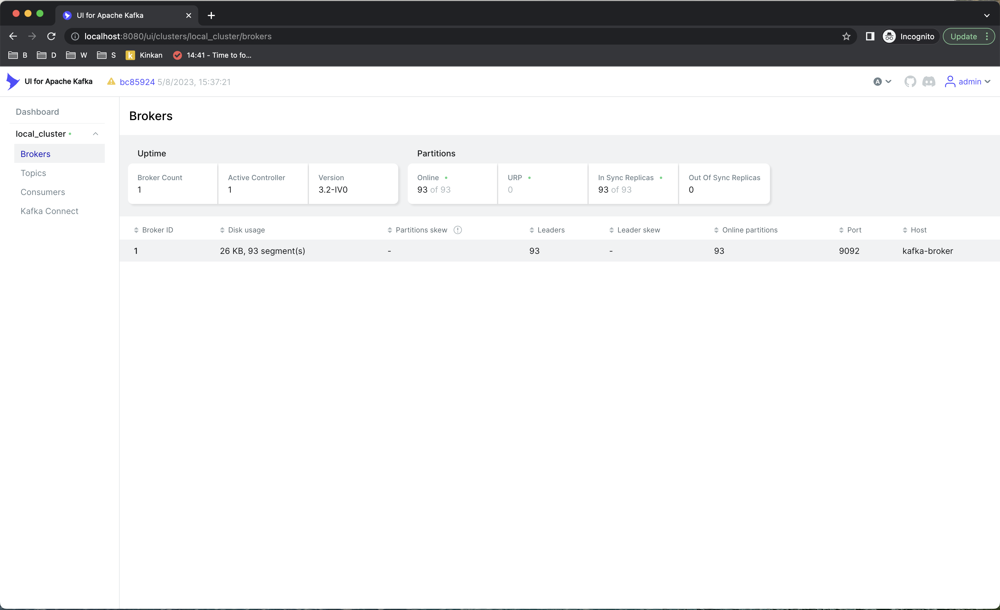
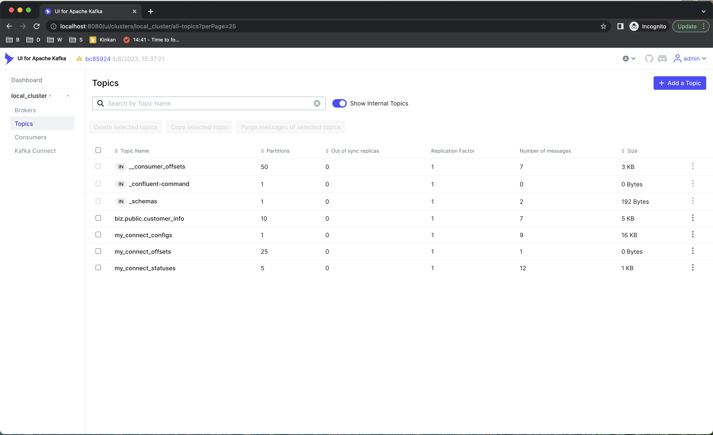
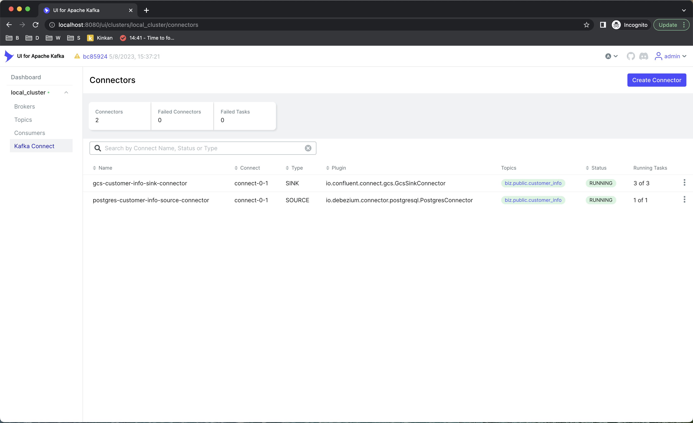
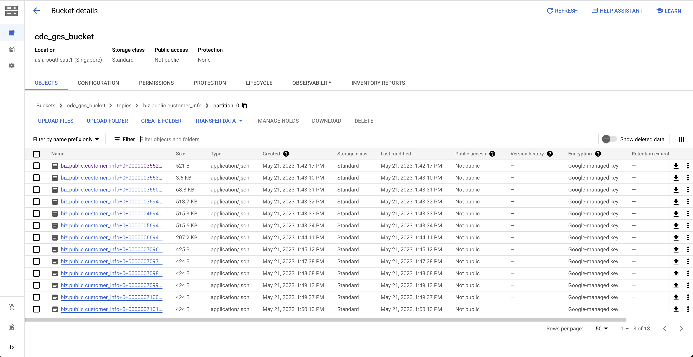
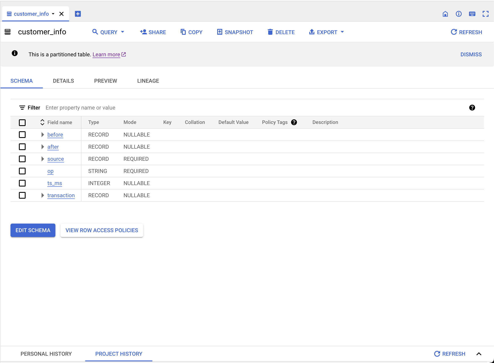
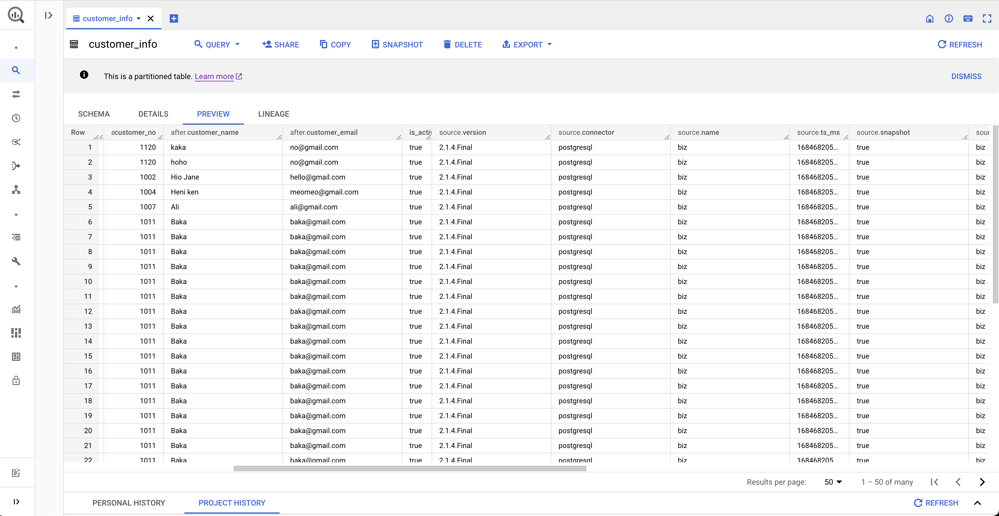

# Debezium do Change Data Capture with Postgres Source to Google Cloud Platform

## Pipeline Architecture

The workflow is reported in: [here](https://app.diagrams.net/#G1Z49aNm1p2B1VoEbvWlsSvBCsZn95zdLD)

## Goal

The goal of this project is to:
-   Capture data change in Postgres database to Google Cloud Storage Sink
-   Capture data change in Postgres database to Google Cloud BigQuery Sink

## Workflow
-   Distributed RDBMS Postgres with [Citus extension](https://github.com/citusdata/citus) use to store sample co-located transaction table across Citus Cluster
-   Debezium Connector captures data change in Postgres database and publish messages to Apache Kafka
-   Apache Kafka is a message queue that decouple source and destination. In this scope, use single node Kafka Broker to develop
-   Debezium (Kafka Connect) integrate with [Sink Connector of Confluent Platform](https://docs.confluent.io/platform/current/connect/kafka_connectors.html) is responsible for processing data in Apache Kafka and load data to Google Cloud Storage, Google Cloud BigQuery
-   Use Kafka UI to manage and monitor Kafka Cluster

## Deployment

Assuming that Docker is installed, simply execute the following command to build and run the Docker Containers:

```
docker compose -f postgres.docker-compose.yaml -f kafka.docker-compose.yaml -f debezium.docker-compose.yaml up
```

To shutdown Docker Containers, execute the following command:

```
docker compose -f postgres.docker-compose.yaml -f kafka.docker-compose.yaml -f debezium.docker-compose.yaml down
```

## Preview
## Execution Plan on Postgres Citus Cluster


## Use Kafka UI to manage Broker, Topic, Partition, Connector (Kafka Connect), metadata and so on....
### Kafka Broker


### Kafka Topic


### Kafka Connector


### Google Cloud Storage sink


### Google Cloud BigQuery sink


