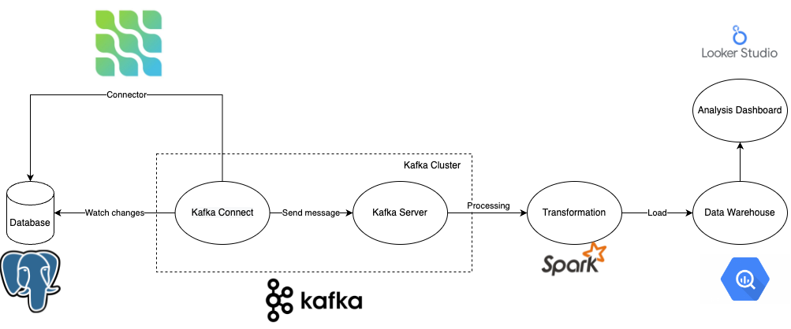
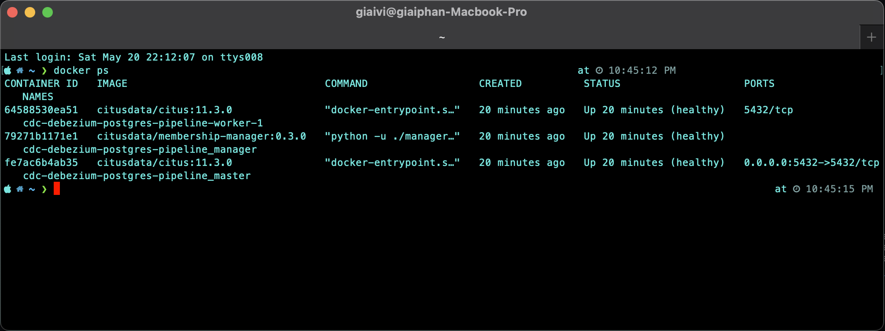
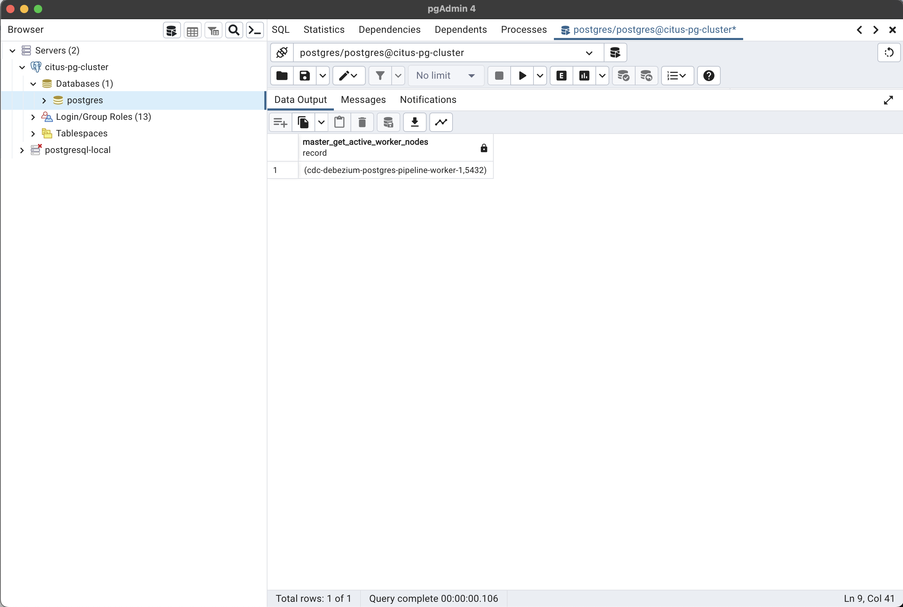
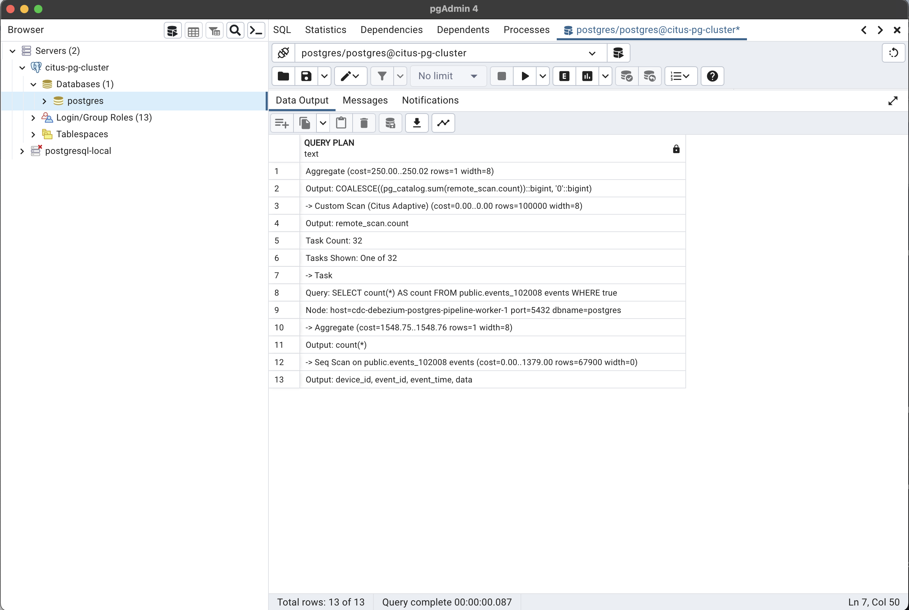

# Debezium do Change Data Capture with Postgres Source to Google Cloud Platform

## Pipeline Architecture

The workflow is reported in: [here](https://app.diagrams.net/#G1Z49aNm1p2B1VoEbvWlsSvBCsZn95zdLD)



## Goal

The goal of this project is to:
-   Capture data change in Postgres database to Google Cloud Storage Sink
-   Capture data change in Postgres database to Google Cloud BigQuery Sink

## Workflow
-   Distributed RDBMS Postgres with [Citus extension](https://github.com/citusdata/citus) use to store sample co-located transaction table across Citus Cluster
-   Debezium Connector captures data change in Postgres database and publish messages to Apache Kafka
-   Apache Kafka is a message queue that decouple source and destination. In this scope, use single node Kafka Broker to develop
-   Debezium (Kafka Connect) integrate with [Sink Connector of Confluent Platform](https://docs.confluent.io/platform/current/connect/kafka_connectors.html) is responsible for processing data in Apache Kafka and load data to Google Cloud Storage, Google Cloud BigQuery
-   Use Kafka UI to manage and monitor Kafka Cluster

## Deployment Service Cluster

### We can use pre-built Docker Image services to deploy a clusters.

See all images here: https://github.com/zaivi/cdc-debezium-postgres-gcp-pipeline/pkgs/container/cdc-debezium-postgres-gcp-pipeline/versions

Pull image from the command line:

```bash
$ docker pull ghcr.io/zaivi/cdc-debezium-postgres-gcp-pipeline:<tag>
```

Use as base image in Dockerfile:

```Dockerfile
FROM ghcr.io/zaivi/cdc-debezium-postgres-gcp-pipeline:<tag>
```

### Image lists

<!-- BEGIN IMAGE LIST -->
- [`Citus Cluster`](#)
    - [`ghcr.io/zaivi/cdc-debezium-postgres-gcp-pipeline:citus-data`](https://github.com/zaivi/cdc-debezium-postgres-gcp-pipeline/pkgs/container/cdc-debezium-postgres-gcp-pipeline/96801521?tag=citus-data)
    - [`ghcr.io/zaivi/cdc-debezium-postgres-gcp-pipeline:membership-manager`](https://github.com/zaivi/cdc-debezium-postgres-gcp-pipeline/pkgs/container/cdc-debezium-postgres-gcp-pipeline/96803717?tag=membership-manager)
- [`Postgres`](#)
    - [`ghcr.io/zaivi/cdc-debezium-postgres-gcp-pipeline:postgres`](https://github.com/zaivi/cdc-debezium-postgres-gcp-pipeline/pkgs/container/cdc-debezium-postgres-gcp-pipeline/96803466?tag=postgres)
- [`Kafka Cluster`](#)
    - [`ghcr.io/zaivi/cdc-debezium-postgres-gcp-pipeline:kafka`](https://github.com/zaivi/cdc-debezium-postgres-gcp-pipeline/pkgs/container/cdc-debezium-postgres-gcp-pipeline/96802541?tag=kafka)
    - [`ghcr.io/zaivi/cdc-debezium-postgres-gcp-pipeline:zookeeper`](https://github.com/zaivi/cdc-debezium-postgres-gcp-pipeline/pkgs/container/cdc-debezium-postgres-gcp-pipeline/96802970?tag=zookeeper)
    - [`ghcr.io/zaivi/cdc-debezium-postgres-gcp-pipeline:schema-registry`](https://github.com/zaivi/cdc-debezium-postgres-gcp-pipeline/pkgs/container/cdc-debezium-postgres-gcp-pipeline/96804722?tag=schema-registry)
    - [`ghcr.io/zaivi/cdc-debezium-postgres-gcp-pipeline:kafka-ui`](https://github.com/zaivi/cdc-debezium-postgres-gcp-pipeline/pkgs/container/cdc-debezium-postgres-gcp-pipeline/96801909?tag=kafka-ui)
- [`Debezium (Kafka Connect)`](#)
    - [`ghcr.io/zaivi/cdc-debezium-postgres-gcp-pipeline:kafka-connect`](https://github.com/zaivi/cdc-debezium-postgres-gcp-pipeline/pkgs/container/cdc-debezium-postgres-gcp-pipeline/96803612?tag=kafka-connect)


### Otherwise, we pull image when running `docker-compose` file

Assuming that Docker is installed, simply execute the following command to build and run the Docker Containers:

```
docker compose -f [postgres.docker-compose.yaml|citus.docker-compose.yaml] -f kafka.docker-compose.yaml -f debezium.docker-compose.yaml up
```

To shutdown Docker Containers, execute the following command:

```
docker compose -f [postgres.docker-compose.yaml|citus.docker-compose.yaml] -f kafka.docker-compose.yaml -f debezium.docker-compose.yaml down
```

## Deployment Debezium

### Register source and sink connector

Example for source Citus connector:

```
curl -X POST -H "Content-Type: application/json" --data @./Kafka-Connect/citus-customer-info-connection.json localhost:8083/connectors
```

To get connector information, use a command:

```
curl -i -X GET -H "Accept:application/json" localhost:8083/connectors/citus-customer-info-source-connector
```

To delete connector, use a command:

```
curl -i -X DELETE localhost:8083/connectors/citus-customer-info-source-connector
```

## Preview
## Execution Plan on Postgres Citus Cluster
```
-- insert some events
INSERT INTO events (device_id, data)
SELECT s % 100, ('{"measurement":'||random()||'}')::jsonb FROM generate_series(1,1000000) s;

-- get the last 3 events for device 1, routed to a single node
SELECT * FROM events WHERE device_id = 1 ORDER BY event_time DESC, event_id DESC LIMIT 3;
┌───────────┬──────────┬───────────────────────────────┬───────────────────────────────────────┐
│ device_id │ event_id │          event_time           │                 data                  │
├───────────┼──────────┼───────────────────────────────┼───────────────────────────────────────┤
│         1 │  1999901 │ 2023-05-22 15:28:23.700068+00 │ {"measurement": 0.88722643925054}     │
│         1 │  1999801 │ 2023-05-22 15:28:23.700068+00 │ {"measurement": 0.6512231304621992}   │
│         1 │  1999701 │ 2023-05-22 15:28:23.700068+00 │ {"measurement": 0.019368766051897524} │
└───────────┴──────────┴───────────────────────────────┴───────────────────────────────────────┘
(3 rows)

Query complete 00:00:00.181

-- explain plan for a query that is parallelized across shards, which shows the plan for
-- a query one of the shards and how the aggregation across shards is done
EXPLAIN (VERBOSE ON) SELECT count(*) FROM events;
┌───────────────────────────────────────────────────────────────────────────────────────────────────────────┐
│                                                QUERY PLAN                                                 │
├───────────────────────────────────────────────────────────────────────────────────────────────────────────┤
│ Aggregate  (cost=250.00..250.02 rows=1 width=8)                                                           │
│   Output: COALESCE((pg_catalog.sum(remote_scan.count))::bigint, '0'::bigint)                              │
│   -> Custom Scan (Citus Adaptive)  (cost=0.00..0.00 rows=100000 width=8)                                  │
│         ...                                                                                               │
│       ->  Task                                                                                            │
│              Query: SELECT count(*) AS count FROM events_102008 events WHERE true                         │
│              Node: host=cdc-debezium-postgres-pipeline-worker-1 port=5432 dbname=postgres                 │
│               ->  Aggregate  (cost=1450.00..1450.01 rows=1 width=8)                                       │
│                     -> Seq Scan on public.events_102008 events  (cost=0.00..1300.00 rows=60000 width=0)   │
└───────────────────────────────────────────────────────────────────────────────────────────────────────────┘
```
- Citus cluter with 1 master, 1 worker and 1 manager







## Use Kafka UI to manage Broker, Topic, Partition, Connector (Kafka Connect), metadata and so on....
### Kafka Broker


### Kafka Topic


### Kafka Connector


### Google Cloud Storage sink


### Google Cloud BigQuery sink


